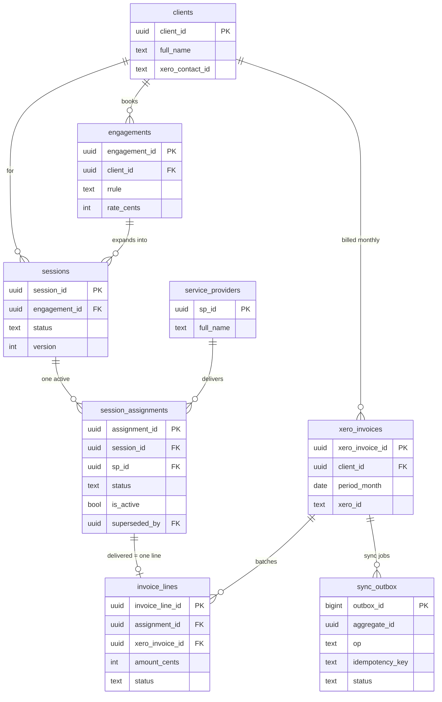
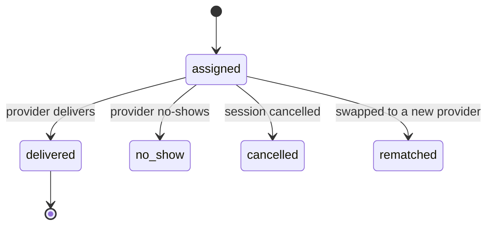

# Recurring sessions: data model, write path & migration

How I'd build this on **Postgres / Supabase**. Four parts, matching the brief:

1. The core tables, keys, and how a **cancel-and-rematch** keeps the full history of who delivered what.
2. How the data stays **consistent** when the portal, n8n and the Xero sync all write the same session at once, and how a **retried automation** doesn't double-process.
3. How delivered sessions become **Xero invoices** (batched, idempotent, safe to correct).
4. How I'd **migrate** an existing system onto this with **zero downtime**.

> Runnable schema lives in [`schema.sql`](schema.sql); a worked end-to-end example is in [`examples/walkthrough.sql`](examples/walkthrough.sql).

## The two calls everything hangs on

- **I don't store "the current provider" on the session.** The second you do that, a rematch overwrites it and you've lost who actually delivered. So *who delivers* gets its own table.
- **I don't trust the portal, n8n and the Xero sync to each be careful on their own.** Three independent writers will race eventually, so I'd rather push the real guarantees down into Postgres than coordinate them in app code.

---

## Schema



### Tables at a glance

| Table | What it's for | PK | Key FKs |
|---|---|---|---|
| `clients` | The people booking sessions | `client_id` | — |
| `service_providers` | Who delivers the sessions | `sp_id` | — |
| `engagements` | A recurring arrangement; carries the price | `engagement_id` | `client_id` |
| `sessions` | A single scheduled slot, never edited | `session_id` | `engagement_id`, `client_id` |
| `session_assignments` | Every provider that held a slot (one active) | `assignment_id` | `session_id`, `sp_id`, `superseded_by` |
| `xero_invoices` | One invoice per client per month (batches lines) | `xero_invoice_id` | `client_id` |
| `invoice_lines` | One issued line per delivered slot | `invoice_line_id` | `assignment_id`, `xero_invoice_id` |
| `sync_outbox` | Queue of Xero sync jobs | `outbox_id` | `aggregate_id` → `xero_invoices` |

Full runnable DDL: [`schema.sql`](schema.sql).

---

## Part 1 — The model & cancel-and-rematch

A `session` is just a slot in time and never gets edited. Who's on the hook to deliver it lives in `session_assignments`, one row per provider that's ever held that slot. A cancel-and-rematch doesn't touch a "provider" field anywhere; it **closes** the old assignment and **opens** a new one. So the history isn't something I have to remember to log, it's just the rows sitting there.

The price lives on the `engagement` and gets copied onto the line at delivery, so a later re-rate never rewrites old invoices:

```sql
create table engagements (
  engagement_id uuid primary key default gen_random_uuid(),
  client_id     uuid not null references clients,
  service_type  text not null,
  rrule         text,                       -- iCal RRULE for the recurrence
  rate_cents    int  not null,              -- price per session, copied at delivery
  currency      char(3) not null default 'AUD',
  status        text not null default 'active',
  created_at    timestamptz not null default now()
);

create table session_assignments (
  assignment_id  uuid primary key default gen_random_uuid(),
  session_id     uuid not null references sessions,
  sp_id          uuid not null references service_providers,
  status         text not null default 'assigned',
                 -- assigned | delivered | no_show | cancelled | rematched
  is_active      boolean not null default true,
  delivered_at   timestamptz,
  cancel_reason  text,
  superseded_by  uuid references session_assignments,  -- old row -> replacement
  version        int  not null default 0,
  created_at     timestamptz not null default now()
);

-- only one live assignment per session, enforced by the DB
create unique index one_active_assignment_per_session
  on session_assignments (session_id) where is_active;
```

An assignment only moves in one direction:



The rematch is one transaction:

```sql
begin;
  select 1 from sessions where session_id = $sid for update;  -- block a 2nd rematch

  update session_assignments
     set status = 'rematched', is_active = false,
         cancel_reason = $reason, version = version + 1
   where session_id = $sid and is_active and status = 'assigned';

  insert into session_assignments (session_id, sp_id, status, is_active)
  values ($sid, $new_sp, 'assigned', true)
  returning assignment_id;   -- set superseded_by on the closed row from this id
commit;
```

The `status = 'assigned'` check stops me rematching something that was already delivered, and the row lock plus that partial unique index mean two rematches firing at once can't both win. One just hits a unique violation and retries. "Who delivered what" ends up being a one-liner (`where status = 'delivered'`), and the trail for a reassigned slot is right there as `old → new`.

### Walkthrough: one session, start to finish

Following client **Maria**, with providers **Alex** and **Bea**:

1. **Maria signs up** for weekly coaching → `clients +1`, `engagements +1` (`rrule = weekly`, `rate_cents` set).
2. **The recurrence is expanded into slots** → `sessions: #1, #2, #3 …`, each `scheduled` and never edited after.
3. **Slot #1 → Alex** → `session_assignments +1` `{ sp: Alex, assigned, is_active: true }`.
4. **Alex delivers #1** → his assignment → `delivered`; an `invoice_line` is created and rolled into Maria's June invoice (more in Part 3).
5. **Slot #2: Alex is out, so we rematch to Bea** → Alex's row becomes `{ rematched, is_active: false, superseded_by → Bea }` (kept, not deleted); Bea gets a fresh `{ assigned, is_active: true }` row. The `sessions` row is untouched.
6. **Bea delivers #2** → a second line on the *same* June invoice. Alex is never billed; he didn't deliver.
7. **"Who delivered what for Maria?"** → `#1 = Alex`, `#2 = Bea`; the trail for #2 is `Alex → Bea`. Nothing overwritten.

(That exact sequence is runnable in [`examples/walkthrough.sql`](examples/walkthrough.sql).)

---

## Part 2 — Three writers, one session

The portal, the n8n flows, and the Xero sync all write the same session. I need two properties: concurrent edits shouldn't clobber each other, and a retried automation shouldn't create duplicates or bill twice. I lean on the database for all of it.

**1. Unique constraints, so retries are cheap.** Only one *issued* line can exist per delivered assignment (a partial unique index on `assignment_id where status = 'issued'`). If n8n's create step runs twice, the second one is a no-op:

```sql
insert into invoice_lines (assignment_id, xero_invoice_id, client_id, sp_id, amount_cents)
values (...)
on conflict (assignment_id) where status = 'issued' do nothing;   -- a retry does nothing
```

This is the main thing stopping a double-bill, and it doesn't rely on the automation being well written.

**2. Idempotency keys for the multi-step stuff.** Each n8n run carries a key like `hash(session_id + 'deliver' + run_id)`, written into a `processed_events` table in the same transaction as the work. Replay the workflow and it collides on the key and bails. The constraint stops a duplicate *row*; the key stops a duplicate *run*.

**3. A version column so edits don't get lost.** Every editable row has a `version`, and updates are conditional on it. Zero rows changed means someone got there first, so I re-read and decide again. No long locks, no lost writes:

```sql
update sessions set status = 'cancelled', version = version + 1
 where session_id = $sid and version = $expected;   -- 0 rows = someone beat me to it
```

**4. One writer to Xero, via an outbox.** The portal and n8n never call Xero directly; that's all of Part 3. It's what stops three systems racing on the same external invoice.

On isolation: `READ COMMITTED` (the Supabase default) plus the row lock above is enough. The only place I'd reach for `SERIALIZABLE` (retrying on a `40001`) is the rematch transaction, since that's the one spot where getting it wrong actually hurts.

---

## Part 3 — Delivered sessions → Xero

Two things matter: a client's deliveries in a month should land on **one** invoice, not one per session; and the sync has to be safe to retry, because n8n will retry and money is the thing you can't get wrong. So delivery writes the billing rows locally and **queues** a sync job. A single worker is the only thing that talks to Xero, which avoids the dual-write trap where the DB commits but the Xero call times out and a retry bills again.

When a session is delivered, all in one transaction:

```sql
begin;
  -- 1. mark the assignment delivered
  update session_assignments
     set status = 'delivered', delivered_at = now(), version = version + 1
   where assignment_id = $aid and status = 'assigned';

  -- 2. make sure this client has an invoice open for the current month
  insert into xero_invoices (client_id, period_month)
  values ($cid, date_trunc('month', now())::date)
  on conflict (client_id, period_month) do nothing;

  -- 3. one issued line per delivered assignment, rolled into that month's invoice
  insert into invoice_lines (assignment_id, xero_invoice_id, client_id, sp_id, amount_cents)
  select $aid, xi.xero_invoice_id, $cid, $sp, $amt
    from xero_invoices xi
   where xi.client_id = $cid and xi.period_month = date_trunc('month', now())::date
  on conflict (assignment_id) where status = 'issued' do nothing;

  -- 4. queue exactly one Xero job for the change
  insert into sync_outbox (aggregate, aggregate_id, op, idempotency_key)
  select 'xero_invoice', xi.xero_invoice_id,
         case when xi.xero_id is null then 'create' else 'update' end,
         'inv:' || xi.xero_invoice_id || ':' || $aid
    from xero_invoices xi
   where xi.client_id = $cid and xi.period_month = date_trunc('month', now())::date
  on conflict (idempotency_key) do nothing;
commit;
```

The worker drains the outbox, and several can run at once without stepping on each other:

```sql
update sync_outbox
   set status = 'processing', attempts = attempts + 1
 where outbox_id = (
   select outbox_id from sync_outbox
    where status = 'pending'
    order by created_at
    for update skip locked
    limit 1)
returning *;
```

Then it loads the `xero_invoices` header plus its `invoice_lines` and checks `xero_id`:

- **null** → `POST` a new invoice to Xero, store the returned `xero_id`, mark `synced`.
- **set** → it already exists (this is a retry, or another line landed) → `PUT`/update it. **Never POST twice.**

So billing twice has to get past three guards: the partial unique index on the line, `unique(idempotency_key)` on the job, and the `xero_id` check before any create. When the month closes the worker finalises the draft into an issued invoice. And if Xero is down, jobs just sit `pending` and drain when it's back; delivery never blocks on an external API.

**Corrections.** I never edit an invoice Xero has already issued. To fix a line I void it (`status = 'voided'`, which frees the partial-unique slot), insert a fresh `issued` line, and let the worker push it to Xero as an adjustment. The history of the original line stays intact.

---

## Part 4 — Migrating with zero downtime

I'd do this as **expand / contract** (parallel change), never a big-bang `ALTER` in a maintenance window. Every step is additive and independently reversible.

**1. Expand, additive and online.** Create the new tables and add any new columns. `CREATE TABLE` and adding a nullable column (or one with a *constant* default on PG11+) are metadata-only and instant. Build indexes with `CREATE INDEX CONCURRENTLY` so I never take a write lock on a live table. Add foreign keys `NOT VALID` first, then `VALIDATE CONSTRAINT` as a separate step so the scan doesn't hold an exclusive lock. And set a short `lock_timeout` so a blocked DDL backs off instead of queueing and stalling every query behind it.

```sql
create unique index concurrently one_active_assignment_per_session
  on session_assignments (session_id) where is_active;

alter table invoice_lines
  add constraint invoice_lines_assignment_fk
  foreign key (assignment_id) references session_assignments not valid;
alter table invoice_lines validate constraint invoice_lines_assignment_fk;
```

**2. Dual-write.** Behind a flag, the app writes both shapes. Every new delivery writes the old representation *and* a `session_assignments` row. From here forward the two stay in sync, so I'm only ever missing history, never live data.

**3. Backfill, batched and resumable.** Copy existing rows into the new tables in chunks, committing each batch with a tiny pause between them. Small transactions keep locks short and stop WAL/replication from blowing up; `on conflict do nothing` makes it safe to re-run.

```sql
-- run in a loop until it affects 0 rows
with batch as (
  select s.session_id, s.sp_id
  from sessions s
  left join session_assignments a on a.session_id = s.session_id
  where a.session_id is null
  order by s.session_id
  limit 2000
)
insert into session_assignments (session_id, sp_id, status, is_active)
select session_id, sp_id, 'delivered', true from batch
on conflict do nothing;
```

**4. Verify.** Still dual-writing, reconcile counts and a checksum of (session → delivering provider) old vs new, and I'd be strict reconciling invoice totals, because that's money. Only proceed when they match.

**5. Cutover.** Flip the read flag so the app reads from the new tables, one slice of traffic at a time. Keep dual-writing for a bake-in period as a rollback path. If anything's off, flip back, nothing lost.

**6. Contract.** Once it's been happy in production for a while, stop writing the old columns and drop them (`DROP COLUMN` / `DROP TABLE` is metadata-only and instant), and add the final `NOT NULL` / constraints now that the new columns are fully populated.

**On Supabase specifically:** I'd keep every step as a versioned migration, and make sure **RLS policies exist on the new tables before any read flips to them** — the portal reads through RLS, so a table without policies reads as empty. No maintenance window, every step reversible, and the only slow part (backfill) runs in the background.

---

## Assumptions

The brief left a few things open, so to be explicit:

- Price lives on the `engagement` (`rate_cents`) and is **copied onto the invoice line at delivery time**, so a later re-rate doesn't rewrite old invoices.
- Billing batches **per client per calendar month** into one Xero invoice. A different cadence is a change to the `xero_invoices` unique key, not the model.
- Once Xero has issued an invoice it owns the number, so I store `xero_id` and never recreate; corrections go through as adjustments.
- One delivered session is one issued invoice line. Partial delivery or multi-currency would add columns to `invoice_lines` but wouldn't change the shape.

## Notes / likely questions

- **Why not an audit/history table instead of `session_assignments`?** Because the invoice has to point at a *specific delivery*. Assignments make the delivery a real, queryable row, and the partial unique index gives the "one active provider" guarantee without any extra code.
- **What enforces one active provider, app code?** No, the database: `create unique index … where is_active`.
- **Why a `sync_outbox` instead of letting n8n call Xero?** One writer to Xero instead of three, idempotent, survives a Xero outage, and delivery doesn't block on an external API.
- **How do you fix a wrong invoice?** Void the line (frees the unique slot), add a fresh one, and sync it to Xero as an adjustment — never an in-place edit of an issued invoice.
- **Co-delivery (two providers on one session)?** Already supported: many assignments per session, so I'd just allow more than one `delivered`.
